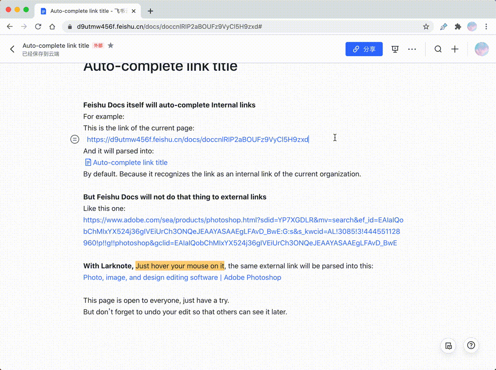

<div align="center" style="margin: 20px">
  
</div>

# Larknote

A chrome extension which can enhance the [feishu documents](https://www.feishu.cn/)’ ability to take notes.

## Features

- [x] Auto-complete link text
- [ ] Ability to keep the sidebar on the document page, not just on the homepage
- [ ] Automatically add back links

## Examples

**Auto-complete link text**



The demo can be found [here](https://d9utmw456f.feishu.cn/docs/doccnlRIP2aBOUFz9VyCl5H9zxd#).

## Development

### Install

Clone this repository, and install dependencies:

```
npm install
```

### Develop

```
npm run dev
```

Unpacked Chrome extension will be compiled into `dist/`.

You can load it into Chrome by enabling developer mode on the "Extensions" page, hitting "Load unpacked", and selecting the `dist/` folder.

When you change the code, the extension will be reload.

### Build

Compile extension:

```
npm run build
```

## Contributing

Issues and PRs are welcome.

## License

[BSD-3-Clause](LICENSE)

